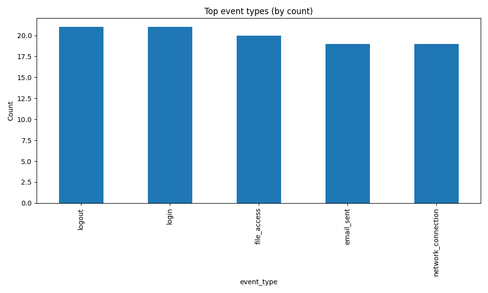
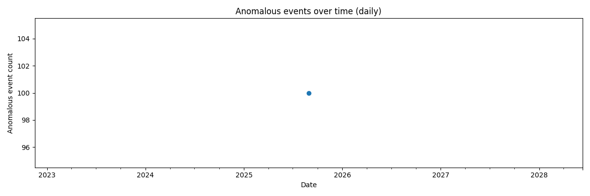

# Forensic Investigation Report

**Generated:** 2025-09-12 03:34:56 UTC

---

## Executive Summary

This report summarizes the final findings from a 5-week forensic investigation.
The analyses used preprocessed evidence, feature-engineered data, anomaly
detection outputs, and entity extraction results to identify suspicious
activity. The visualizations included support the findings and provide quick,
interpretable evidence for stakeholders.

## Data Sources and Schema

The following CSV files were used as inputs for this final report:

- `anomalies_detected_evidence.csv`

- `extracted_entities.csv`

### anomalies_detected_evidence.csv (schema preview)

- **timestamp** — object, non-null: 100

- **user_id** — object, non-null: 100

- **event_type** — object, non-null: 100

- **message** — object, non-null: 100

- **hour_of_day** — int64, non-null: 100

- **day_of_week** — int64, non-null: 100

- **is_weekend** — bool, non-null: 100

- **is_anomaly** — int64, non-null: 100

### extracted_entities.csv (schema preview)

- **row_id** — int64, non-null: 140

- **entity_text** — object, non-null: 140

- **entity_label** — object, non-null: 140

## Methodology

The investigation followed a structured workflow: acquisition of raw evidence,
preprocessing/cleaning, feature engineering, anomaly detection, and entity
extraction. For the final synthesis, we aggregated anomaly outputs and extracted
entities, computed distributions of event types, inspected anomaly severity
where available, and plotted trends over time. Visualizations were produced
using Matplotlib to ensure reproducibility and high-quality embedding in
reports.

## Key Findings

### 1) Event distribution (by `event_type`)

Top event types detected in anomalous records:

- **logout** — 21 occurrences

- **login** — 21 occurrences

- **file_access** — 20 occurrences

- **email_sent** — 19 occurrences

- **network_connection** — 19 occurrences

### 3) Timeline of anomalous events

Anomalous events were aggregated daily to visualize trends. See
`anomaly_timeline.png` for details. Sudden spikes in daily counts may indicate
concentrated attack windows or misconfigurations worth further investigation.

### 4) Extracted entities of interest

The most commonly extracted entities (top 20):

- **1** — 5 mentions

- **2** — 5 mentions

- **4** — 5 mentions

- **6** — 5 mentions

- **12** — 5 mentions

- **10** — 5 mentions

- **25** — 5 mentions

- **24** — 5 mentions

- **21** — 5 mentions

- **44** — 5 mentions

- **100** — 5 mentions

- **71** — 5 mentions

- **70** — 5 mentions

- **54** — 5 mentions

- **50** — 5 mentions

- **90** — 5 mentions

- **80** — 5 mentions

- **87** — 5 mentions

- **49** — 5 mentions

- **69** — 2 mentions

## Recommendations

1. Prioritize investigation of the top event types and related entities (IPs,
users, files). 2. Correlate anomalies with external logs (firewall, IDS) and
asset owners. 3. If severity scores are high, consider immediate containment
(credential reset, network isolation). 4. Preserve evidence and document chain-
of-custody for any actions taken.

## Appendix: Notes on analysis

This report was auto-generated by final_report.py. All visualizations and the
Markdown report are reproducible. If column names differ across datasets, the
script performs heuristics to pick sensible defaults — however, for formal court
submissions, manually inspect the CSV headers and adjust the script to use
explicit column names to avoid ambiguity.

